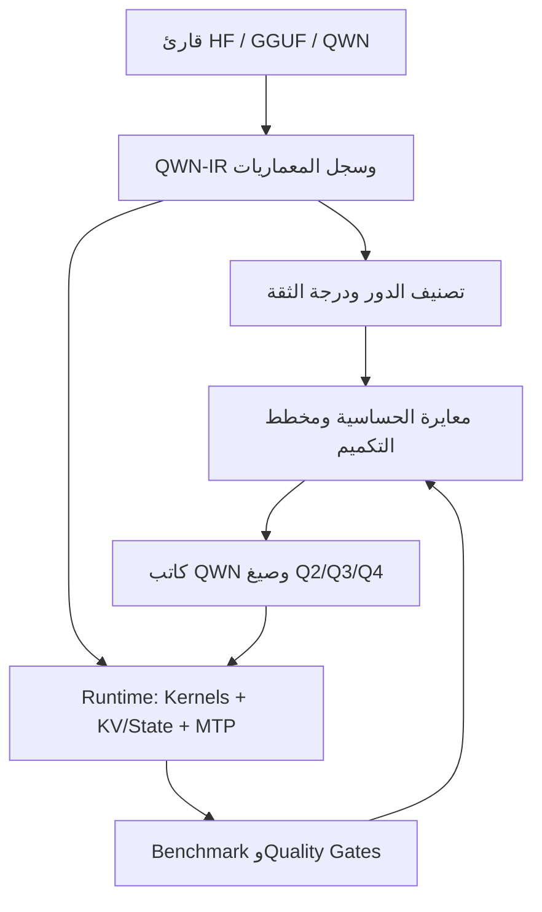

# خطة تطوير Universal Qwanto Engine 2.0

## 1. تصحيح الأساس الهندسي

قبل التنفيذ يجب تحويل الأرقام الحالية من وعود ثابتة إلى أهداف قابلة للقياس:

| الادعاء الحالي                     | الواقع الهندسي                                                           | الهدف الصحيح                                                                       |
| ---------------------------------- | ------------------------------------------------------------------------ | ---------------------------------------------------------------------------------- |
| `1.75–1.95 bpw` لتكميم ثابت 2-bit  | تخزين 16 وزناً في 4 بايت يساوي `2.00 bpw` قبل المقاييس والبيانات الوصفية | اعتماد `2.25–2.50 bpw` لصيغة SIMD ثابتة، أو استخدام متوسط مختلط على مستوى النموذج  |
| `HyperVSQ2` الحالي قريب من 2.1 bpw | الكتلة الحالية 74 بايت لكل 256 وزناً: `74×8÷256 = 2.3125 bpw`            | عرض الرقم الحقيقي شاملاً metadata والمحاذاة وبيانات القيم الشاذة                   |
| صفحة KV ثابتة 16KiB                | الموجود حالياً كتلة من 16 توكناً؛ حجمها بالبايت يختلف حسب النموذج        | فصل “كتلة توكنات منطقية” عن “صفحة ذاكرة فعلية”                                     |
| `850+ tok/s` من النواة             | هذا قد يكون معدل microkernel، وليس توليد النموذج الكامل                  | فصل GB/s وcycles/weight عن decode tok/s الفعلي                                     |
| دقة أعلى من 97.5% لجميع النماذج    | “الدقة” ليست مقياساً موحداً                                              | بوابات جودة منفصلة: PPL، KL، مهام تقييم، Router agreement، واختبارات السياق الطويل |

في الصيغة الحالية، حجم `HyperVSQ2` الحقيقي هو 2.3125 بت/وزن، بينما `HyperVSQ` ذو 138 بايت لكل 256 وزناً يساوي 4.3125 بت/وزن. يجب أن تصبح هذه الحسابات مولّدة آلياً في التقرير، لا مكتوبة يدوياً.

## 2. المعمارية المقترحة



المبدأ الأساسي: لا يمكن أن يكون المحرك عاماً بالاعتماد على أسماء التنسورات فقط. التصميم الصحيح هو:

* نواة عامة موحّدة.
* تمثيل وسيط `QWN-IR`.
* محولات صغيرة `ArchAdapter` لكل عائلة معمارية.
* مصنف أسماء وأشكال كوسيلة احتياطية.
* معايرة فعلية قبل اختيار عدد البتات.

## 3. مرحلة QWN-IR والتعرف على المعمارية

### واجهة المحول المعماري

يقترح تعريف واجهة منطقية مثل:

```python
class ArchAdapter:
    def detect(metadata, tensors) -> Confidence
    def build_graph(metadata, tensors) -> ModelIR
    def classify_tensor(node) -> TensorRole
    def validate_shapes(graph) -> ValidationReport
    def kv_layout(graph) -> CacheLayout
    def mtp_layout(graph) -> MTPPlan | None
```

### البيانات التي يجب تحليلها

* `model_type` و`architectures`.
* عدد الطبقات والرؤوس ورؤوس KV.
* `hidden_size` و`intermediate_size` و`head_dim`.
* نوع RoPE وGQA/MQA.
* عدد الخبراء و`top_k`.
* رؤوس MTP الفعلية.
* معاملات MLA.
* معاملات Mamba/SSM وConv1D.
* التضمينات المشتركة `tied embeddings`.
* QKV المدمج أو المنفصل.

### سياسة دعم المعماريات

| العائلة                      | المعالجة الخاصة                                        |
| ---------------------------- | ------------------------------------------------------ |
| Llama/Qwen/Mistral/Gemma/Phi | GQA، RoPE، fused QKV، RMSNorm، اختلافات MLP            |
| DeepSeek/MoE                 | Router عالي الدقة، shared experts، routed experts، MLA |
| Mamba/SSM                    | مخزن حالة متكررة بدلاً من KV، وحماية `A/D/dt`          |
| Hybrid Transformer–SSM       | تحديد نوع كل طبقة على حدة                              |
| MTP/Medusa-like              | اكتشاف الرؤوس وترتيب التنبؤ والتحقق                    |
| معمارية مجهولة               | Q8/FP16 آمن أو رفض واضح؛ لا يُطبق Q2 تلقائياً          |

نتيجة التصنيف يجب أن تحتوي على:

```text
role, confidence, evidence[], hard_constraints[], recommended_modes[]
```

إذا كانت الثقة أقل من حد مثل `0.90`، يمنع التكميم العدواني تلقائياً.

## 4. مصنف أدوار التنسورات

ترتيب أدلة التصنيف:

1. موقع العملية في الرسم الحسابي.
2. metadata الخاصة بالمعمارية.
3. علاقات الأبعاد مع بقية التنسورات.
4. الاسم كدليل أخير.

أمثلة العلاقات:

* `gate/up`: شكل قريب من `[intermediate, hidden]`.
* `down`: شكل `[hidden, intermediate]`.
* Router: `[num_experts, hidden]`.
* Fused QKV: البعد الناتج مشتق من عدد رؤوس Q وKV و`head_dim`.
* LM head: بعد يساوي حجم المفردات.
* التضمينات المشتركة: نفس التخزين أو نفس hash.
* MTP: رأس إخراج إضافي مرتبط بمستوى تنبؤ مستقبلي.

يجب أن يُصدر المصنف ملفاً تفسيرياً `quant_plan.json` يوضح سبب كل قرار، حتى لا يصبح السلوك “صندوقاً أسود”.

## 5. مخطط التكميم المتكيف

الاسم يحدد الدور، لكنه لا يحدد الحساسية. الحساسية تحتاج بيانات تنشيط ومعايرة. يوصى بمزج قياسات activation-aware مع خطأ إعادة بناء الطبقة ومعلومات Hessian التقريبية؛ وهو اتجاه تدعمه أساليب مثل [GPTQ](https://arxiv.org/abs/2210.17323) و[AWQ](https://arxiv.org/abs/2306.00978).

### نمطان للتشغيل

* `heuristic-safe`: سريع، لا يحتاج dataset، ولا يسمح بـQ2 إلا في المناطق المعروفة والآمنة.
* `calibrated`: يستخدم 128–512 عينة ممثلة للاستخدام الفعلي: عربي، إنجليزي، برمجة، رياضيات، وسياق طويل.

### مقاييس الحساسية

* خطأ خرج الطبقة المعياري.
* KL divergence بين logits الأصلية والمكممة.
* تغير Perplexity.
* حجم القيم الشاذة في activations.
* تغير ترتيب Router top-k.
* انحراف حالة SSM عبر تسلسل طويل.
* تأثير الطبقة في المهام النهائية.

ثم يحل المخطط مسألة تخصيص ميزانية:

[
\min_{{q_t}}
\sum_t E(t,q_t)+\lambda L(t,q_t)
\quad
\text{مع}
\quad
\sum_t B(t,q_t)\le B_{\text{target}}
]

حيث (E) خطأ الجودة، و(L) كلفة التنفيذ، و(B) الحجم الحقيقي.

### السياسة الابتدائية المقترحة

| الدور                | المرشحون      | الحماية                                              |
| -------------------- | ------------- | ---------------------------------------------------- |
| Norm وBias           | FP16/BF16     | لا تُكمم إلى Q8 دون فائدة واضحة                      |
| Embeddings وLM head  | Q6/Q8 أو FP16 | الحفاظ على logits، مع إزالة التخزين المكرر عند الربط |
| Q/K                  | Q4/Q5         | حساسة لمواضع الانتباه وRoPE                          |
| V/O                  | Q3/Q4         | حسب KL وخطأ attention                                |
| FFN gate/up          | Q2A/Q3        | Q2 فقط بعد بوابة جودة                                |
| FFN down             | Q3/Q4         | يبدأ بدقة أعلى من gate/up                            |
| Routed experts       | Q2A/Q3        | الاستفادة من كون جزء منها فقط نشطاً                  |
| Shared experts       | Q3/Q4         | أكثر استخداماً من routed experts                     |
| Router               | Q6/Q8         | اختبار تطابق top-k إلزامي                            |
| SSM `A/D/dt` والحالة | FP16/Q8       | منع تراكم الانحراف                                   |
| MTP heads            | Q6/Q8         | للحفاظ على معدل القبول                               |

### معالجة القيم الشاذة

بدلاً من رفع دقة مصفوفة كاملة:

* تخزين 0.1–1% من القنوات الحساسة في Q8/FP16 sidecar.
* إبقاء الجزء الأكبر في Q2/Q3.
* دمج مساهمة outliers داخل النواة.
* احتساب sidecar ضمن effective bpw الحقيقي.

ويجب رفض إعادة التكميم من GGUF منخفض البت إلى Q2 افتراضياً، لأن Q4→Q2 يراكم الخطأ. المصدر المفضل هو FP16/BF16.

## 6. صيغة Q2 جديدة قابلة لـSIMD

يقترح الحفاظ على `HyperVSQ2` القديم للتوافق، وإضافة صيغة جديدة ذات ABI مستقل مثل `Q2A_256`.

### تصميم كتلة Q2A_256

| المكون                      |    الحجم |
| --------------------------- | -------: |
| 256 رمزاً × 2-bit           |  64 بايت |
| Base scale FP16             |   2 بايت |
| ثمانية sub-scales من 4-bit  |   4 بايت |
| ثمانية zero-points من 2-bit |   2 بايت |
| المجموع                     |  72 بايت |
| المعدل                      | 2.25 bpw |

صيغة الاسترجاع:

[
w_i = d \cdot s_g \cdot (q_i-z_g)
]

أفضل تخطيط هو Structure-of-Arrays لكل صف:

* metadata متجاورة في مستوى صغير.
* رموز Q2 في مستوى مستقل ومحاذى إلى 64 بايت.
* محاذاة مرة واحدة لكل صف، لا padding لكل كتلة.
* وصف صريح للإصدار والحجم وgroup size.
* CRC لكل تنسور وSHA256 لخطة التكميم.
* تسجيل `payload_bpw` و`effective_bpw` منفصلين.

الوصول إلى أقل من 2 بت/وزن يتطلب sparsity أو entropy coding أو أوزاناً ثنائية. هذه الأساليب تضر الوصول العشوائي ومسار SIMD، لذلك لا تُعتمد افتراضياً.

## 7. أنوية CPU المحسنة

### بنية التوزيع

يجب فصل الأنوية إلى وحدات مستقلة:

* Scalar مرجعية.
* ARM NEON/DOTPROD.
* AVX2.
* AVX-VNNI.
* AVX-512 VNNI.
* Dispatcher يعتمد CPUID وقت التشغيل.

تعليمة `_mm256_dpbusd_epi32` ليست مسار AVX2 عاماً؛ يجب عدم استدعائها دون اكتشاف VNNI. وينبغي تجميع كل ملف kernel بخيارات ISA الخاصة به بدلاً من بناء البرنامج كله بـ`-march=native`. مرجع التعليمات والـCPUID متاح في [دليل امتدادات Intel](https://www.intel.com/content/dam/develop/external/us/en/documents/architecture-instruction-set-extensions-programming-reference-737410.pdf).

### خوارزمية Q2 الأفضل

* تمثيل الوزن كـunsigned `0..3`.
* تحويل activation إلى signed INT8 لكل tile.
* حساب:

[
(q-z)\cdot x=q\cdot x-z\sum x
]

* حساب (\sum x) مرة واحدة وإعادة استخدامه.
* AVX2: استخدام `shuffle/mask` ثم `maddubs` و`madd`.
* VNNI: استخدام `dpbusd` مع مصحح zero-point.
* تجنب فك الأوزان إلى FP32.
* استخدام 2–4 accumulators مستقلة لمنع dependency stalls.
* معالجة عدة صفوف معاً.
* تأخير horizontal reduction إلى نهاية tile.
* prefetch مضبوط، مع قياس فائدته بدلاً من فرضه.
* تقسيم OpenMP على صفوف الإخراج ومنع nested parallelism.

`_mm256_shuffle_epi8` جزء من عملية الفك، لكنه لا يجعل فك الرموز والضرب وتطبيق المقاييس يحدث في “دورة واحدة”.

### فصل Prefill عن Decode

* Decode: نواة GEMV موجهة لنطاق الذاكرة.
* Prefill/batching: نواة GEMM مبلطة.
* MoE: prefetch للخبراء المختارين فقط، وإبقاء shared experts ساخنة.
* Auto-tuner يختار tile size وعدد الخيوط ونوع النواة وفق CPU وعرض الذاكرة.

الحد التقريبي للتوليد في نموذج Dense:

[
\text{tok/s}_{max}\approx
\frac{\text{sustained memory bandwidth}}
{\text{active weight bytes per token}}
]

مثلاً: نموذج بحجم 3GB على ذاكرة توفر 60GB/s حده النظري قرابة 20 tok/s قبل أي overhead. لذلك 850 tok/s لنواة صغيرة لا يساوي 850 tok/s للنموذج.

## 8. Paged KV وSSM State

حجم KV لتوكن واحد في Transformer تقليدي:

[
\text{bytes/token}=2L H_{kv}D_h b
]

لنموذج فيه 32 طبقة و8 رؤوس KV و`head_dim=128` وFP16، يصبح الحجم 128KiB لكل توكن؛ أي إن كتلة من 16 توكناً تساوي قرابة 2MiB، وليست 16KiB.

### التصميم الصحيح

* `logical_block_tokens`: ‏8 أو 16 أو 32 توكناً.
* slab allocator منفصل لكل طبقة أو مجموعة طبقات.
* صفحات النظام: 4KiB/16KiB أو huge pages كخيار تخزين، لا كوحدة توكن.
* block table لكل طلب.
* free-list وwatermarks.
* reference counting لمشاركة prefix.
* Copy-on-Write عند التفرع.
* LRU/Clock eviction.
* حساب وقياس fragmentation بدلاً من ادعاء انعدامها.

حجم block الأمثل يعتمد على طول الطلب وحمل التشغيل؛ حتى تصميم PagedAttention يوضح وجود موازنة بين التوازي والتشتت، ويستخدم 16 توكناً كإعداد عملي وليس قاعدة بايت عالمية. [بحث PagedAttention](https://arxiv.org/abs/2309.06180)

### تكميم KV

الخطة الأفضل ليست Q4 موحداً:

* Key: per-channel asymmetric quantization.
* Value: per-token asymmetric quantization.
* نافذة حديثة FP16/Q8.
* ضغط الكتل الأقدم إلى Q4 أولاً، ثم Q2 كخيار تجريبي.
* دمج فك التكميم داخل attention kernel.
* تخزين scales في مستوى مستقل.

هذا يتوافق مع نتيجة KIVI التي وجدت اختلافاً واضحاً بين أفضل اتجاه لتكميم K وV، وأهمية نافذة حديثة عالية الدقة. [بحث KIVI](https://arxiv.org/abs/2402.02750)

أما Mamba/SSM فيحتاج `StatePool` منفصلاً، وConv ring buffer، ولا يجب تمريره عبر واجهة KV الوهمية.

## 9. Speculative Decoding وMTP

الوحدة الموجودة حالياً تحتاج إعادة تصميم قبل دمجها؛ التحقق فيها تسلسلي، والـrollback يغير position فقط ولا يعيد KV، كما أن مقارنة قيم logits بنسبة 95% ليست قاعدة قبول صحيحة.

### مسار Draft الصحيح

1. التأكد من تطابق tokenizer hash والمفردات والرموز الخاصة.
2. توليد (\gamma) مقترحات مع حفظ توزيعات (q_i).
3. تشغيل target على جميع المقترحات في forward مكدس واحد.
4. التحقق حسب الموضع الصحيح قبل إدخال التوكن التالي.
5. Commit لأطول prefix مقبول.
6. تحرير جميع صفحات KV المرفوضة.
7. تحديث draft بالتوكن المصحح.
8. بث التوكنات للمستخدم بعد commit فقط.

للتوليد العشوائي:

[
P(\text{accept})=\min\left(1,\frac{p_i(x)}{q_i(x)}\right)
]

وعند الرفض تؤخذ العينة من التوزيع المصحح المتناسب مع:

[
\max(p_i-q_i,0)
]

هذه القاعدة تحافظ على توزيع target، وهو جوهر speculative decoding الصحيح. [بحث Speculative Decoding الأصلي](https://proceedings.mlr.press/v202/leviathan23a.html)

### KV Transactions

كل checkpoint يجب أن يحفظ:

* position.
* أطوال block tables لكل طبقة.
* refcounts.
* الصفحات المؤقتة.
* sampler RNG.
* repetition/grammar state.
* stop-sequence state.

إرجاع position وحده قد يترك KV تالفة.

### Native MTP

* لا يُفعّل بناء على اسم المعمارية فقط.
* يجب وجود tensors ورؤوس MTP متوافقة فعلياً.
* تحتاج كل معمارية `MTPAdapter`.
* التنبؤ الثاني يحتاج تحققاً، وليس إخراج توكنين مضمونين دائماً.
* DeepSeek-V3 مثلاً يذكر عمق MTP إضافياً واحداً وتسارعاً مقاساً بنحو 1.8× في إعدادهم، وليس ضماناً عاماً 2–3×. [تقرير DeepSeek-V3](https://arxiv.org/abs/2412.19437)

### اختيار Draft تلقائياً

يوضع manifest بجانب كل نموذج مسودة يحتوي على:

* tokenizer SHA256.
* target families.
* vocab size.
* context وRoPE compatibility.
* سرعة draft المقاسة.
* acceptance rate حسب المجال.

يُجرى probe قصير ويُختار النموذج صاحب أعلى تسارع متوقع، لا الأصغر حجماً فقط. إذا كان المتوقع أقل من 1×، يُعطّل المسار تلقائياً.

ترتيب fallback:

1. Native MTP.
2. Draft متوافق.
3. Prompt-lookup/ngram speculation.
4. Decode تقليدي.

## 10. نظام Benchmark حقيقي

الأولوية الأولى هي استبدال القياسات الحالية؛ `qwn_benchmark.py` يعتمد حالياً على محاكاة للتوليد وPPL، و`run_matrix.py` يحتوي نتائج mock.

### بروتوكول القياس

* اكتشاف `models/**/*.qwn`.
* بناء `qwnrun` مرة واحدة.
* إبقاء النموذج محملاً عبر بروتوكول persistent.
* 3 جولات warmup و5–10 جولات قياس.
* فصل cold-load عن warm-cache.
* تثبيت seed والنص ودرجة الحرارة.
* تسجيل affinity وNUMA والخيوط وتردد CPU.
* عدم استبدال الفشل بقيمة افتراضية أو mock.

### المقاييس المطلوبة

| الفئة       | المقاييس                                                |
| ----------- | ------------------------------------------------------- |
| التخزين     | payload bpw، effective bpw، metadata، padding           |
| التحميل     | زمن الفتح، mmap، page faults                            |
| Prefill     | TTFT وprefill tok/s                                     |
| Decode      | tok/s وp50/p95/p99 latency                              |
| الذاكرة     | RSS/PSS، KV bytes/token، fragmentation                  |
| النواة      | GB/s، cycles/weight، cache misses                       |
| Speculative | acceptance، accepted tokens/target call، draft overhead |
| MoE         | router agreement، الخبراء النشطون، page faults          |
| الطاقة      | joules/token عند توفر RAPL                              |
| الجودة      | PPL، KL، task score، long-context retrieval             |

كل تقرير JSON يجب أن يحتوي على:

* Git SHA.
* model SHA256.
* quant plan hash.
* compiler والخيارات.
* CPU/RAM/OS.
* الأمر كاملاً.
* prompt hash.
* النتائج الخام والتجميع الإحصائي.

## 11. ملفات ووحدات مقترحة عند التنفيذ لاحقاً

```text
c/tools/qwn_model_ir.py
c/tools/qwn_arch_registry.py
c/tools/qwn_roles.py
c/tools/qwn_calibrate.py
c/tools/qwn_quant_plan.py
c/tools/qwn_convert.py

c/quant/qwn_q2a.h
c/kernels/qwn_gemv_q2_scalar.c
c/kernels/qwn_gemv_q2_avx2.c
c/kernels/qwn_gemv_q2_vnni.c
c/kernels/qwn_gemv_q2_neon.c
c/qwn_cpu_dispatch.c

c/qwn_paged_kv.c
c/qwn_state_pool.c
c/qwn_kv_txn.c
c/qwn_speculative.c
c/qwn_mtp.c

c/tools/qwn_benchmark.py
c/benchmarks/schema.json
```

يبقى `qwn_convert.py` منفذاً للخطة، ولا يُحمّل مسؤولية اكتشاف المعمارية والمعايرة والتحسين كلها داخل ملف واحد.

## 12. مراحل التنفيذ ومعايير الخروج

| المرحلة              | العمل                                 | شرط الانتقال                               |
| -------------------- | ------------------------------------- | ------------------------------------------ |
| 0. الحقيقة المعيارية | Benchmark حقيقي وتدقيق bpw والادعاءات | تقرير قابل للتكرار بلا simulation/mock     |
| 1. QWN-IR            | سجل معماريات ومصنف بدرجة ثقة          | اكتشاف صحيح لنموذجين على الأقل من كل عائلة |
| 2. Quant Planner     | معايرة، profiles، budget optimizer    | خطة قابلة لإعادة الإنتاج مع أسباب كل قرار  |
| 3. Q2A Format        | ABI جديد وlegacy decoder              | round-trip واختبارات tails/checksum        |
| 4. SIMD Kernels      | Scalar/AVX2/VNNI/NEON                 | تطابق scalar وتحسن طرفي فعلي عن Q4         |
| 5. Paged State       | KV allocator وSSM pool                | لا تسرب، مشاركة prefix، قياس fragmentation |
| 6. Speculative/MTP   | Batch verification وKV transactions   | تطابق greedy وتوزيع sampling الصحيح        |
| 7. التثبيت           | CI، fuzzing، sanitizers، تقارير جودة  | اجتياز جميع بوابات الإصدار                 |

الترتيب الحرج هو: القياس أولاً، ثم QWN-IR والتكميم، ثم الأنوية، ثم KV transactional، وأخيراً speculative/MTP.

## 13. أهداف الحجم الواقعية

هذه أوزان فقط، قبل KV وruntime، بوحدة GB العشرية:

| Profile     | effective bpw |      1.5B |        4B |        8B |        14B |         70B |
| ----------- | ------------: | --------: | --------: | --------: | ---------: | ----------: |
| Tiny تجريبي |       2.5–3.0 | 0.47–0.56 | 1.25–1.50 | 2.50–3.00 |  4.38–5.25 | 21.88–26.25 |
| Balanced    |       3.2–4.0 | 0.60–0.75 | 1.60–2.00 | 3.20–4.00 |  5.60–7.00 | 28.00–35.00 |
| Quality     |       4.5–6.0 | 0.84–1.13 | 2.25–3.00 | 4.50–6.00 | 7.88–10.50 | 39.38–52.50 |

حجم 19.5GB لنموذج 70B يعني نحو 2.23 bpw شامل جميع الأوزان، وهو هدف شديد العدوانية لا ينسجم افتراضياً مع إبقاء Router وNorm وEmbeddings بدقة مرتفعة. تشغيل 70B على RAM بسعة 24GB يجب أن يبقى حالة تجريبية؛ 32GB هدف أكثر واقعية.

## 14. بوابات الإصدار المقترحة

* `Quality`: ارتفاع PPL نسبي ≤1% وهبوط المهام ≤0.5 نقطة.
* `Balanced`: ارتفاع PPL ≤3% وهبوط المهام ≤1.5 نقطة.
* `Tiny`: ارتفاع PPL ≤8% وهبوط المهام ≤3 نقاط، مع تحذير واضح.
* Router top-k agreement لا يقل افتراضياً عن 99.5%.
* Greedy speculative ينتج التوكنات نفسها تماماً.
* Sampling speculative يجتاز اختباراً إحصائياً مقابل target.
* لا illegal instructions على CPU غير داعم.
* لا قراءة خارج الحدود أو overflow في ملفات QWN.
* لا ادعاء سرعة إلا من end-to-end benchmark.
* إذا لم تتفوق Q2 طرفياً على Q4 على جهاز معين، يختار الـauto-tuner Q3/Q4 بدلاً منها.
