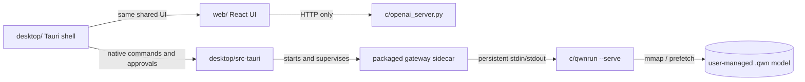

# Qwanto Code

[](https://github.com/SaifHu98/Qwanto/actions/workflows/ci.yml)
[](https://github.com/SaifHu98/Qwanto/releases)
[](LICENSE)
[](docs/local-only.md)
[](docs/packaging.md)

> A local-first native runtime, supervised loopback gateway, and OpenCode-style desktop coding agent for validated QWN models.

<p align="center"></p>

Qwanto Code is a Beta local-first AI runtime for running supported dense transformer
models through a native C decoder, a supervised loopback OpenAI-compatible
gateway, a shared React dashboard, and a Tauri desktop coding agent.

The repository is engineering-complete for its tested paths, but it is not a
promise that every model, GPU backend, sensor, or platform is production-ready.
Read the status and evidence before relying on a path.

## Engine Highlights

- **QWN containers:** validated 4 KiB headers, aligned tensor payloads, 64-byte
  padding, and tiered VRAM → RAM → NVMe mmap with layer-ahead prefetch.
- **Persistent `qwnrun --serve`:** one supervised native process handles the
  protocol and avoids per-request process startup.
- **Local gateway:** loopback-only OpenAI-compatible endpoints with explicit
  model validation and user-managed model files.
- **Approval-gated agent:** the desktop shell can inspect a selected workspace,
  but file writes, commands, and external search require a visible approval.
- **Desktop coding workspace:** Project, Chats, Files, Changes, and Settings stay
  focused; local attachments are stored in the workspace with a hard size limit,
  and unsupported model input types remain explicitly unavailable.
- **Local feedback:** Diagnostics can create a redacted ZIP for manual GitHub
  issue or email attachment. Nothing is uploaded or emailed without a user action.
- **Optional GitHub and internet tools:** external features remain disabled until
  explicitly enabled and approved; local inference never falls back to cloud AI.
- **Platform support:** Tauri packaging targets Windows, macOS, and Linux;
  platform packages remain unsigned unless the protected signing gates pass.

## Verified Native Performance

The measured result below is the repository’s current native evidence. It is
separate from experimental, external-provider, and projected results; it is
not a universal throughput promise. See the [benchmark methodology](docs/benchmark-methodology.md)
for the required evidence fields and classification rules.

| Host evidence | Model | Runtime | Tokens | Wall time | Throughput | TTFT |
| --- | --- | --- | ---: | ---: | ---: | ---: |
| Windows local run | `experiments/results/4B_hyper_vsq2.qwn` | `c/qwnrun.exe` | 64 | 8.952839 s | 7.148571 tok/s | Unavailable |

## Why Qwanto

Qwanto keeps model execution on the user’s machine. The native runtime reads a
validated `.qwn` container through the project’s VRAM → RAM → NVMe tiered
memory design, while the local gateway exposes a familiar API and the React
dashboard reports the gateway’s actual state. The Tauri desktop shell packages
the UI, target-native `qwnrun`, and the target-native gateway sidecar; it never
bundles model weights.

### User stories

- As a local developer, I can start a gateway and use `/v1/chat/completions`
  from the dashboard or another OpenAI-compatible client.
- As a model owner, I can import a supported local checkpoint, convert it to
  `.qwn`, validate it, and see why a native model is or is not selectable.
- As a performance engineer, I can inspect measured benchmark evidence tied to
  a model and runtime hash without seeing fabricated TTFT or throughput.
- As a desktop user, I can use the shared web experience with approval-gated
  native commands while model files remain user-managed.

## Architecture



The browser UI is a safe local chat client: it has no project, filesystem,
terminal, diff, or agent authority. Only the desktop host starts the packaged
sidecar and `qwnrun`, and exposes approval-gated project/file/terminal/diff
tools. Models are never bundled.

## Current support matrix

| Surface | Status | Validation |
| --- | --- | --- |
| Native decoder and persistent serve protocol | Beta-supported | C/Python tests and CI |
| Loopback gateway and OpenAI-compatible API | Beta-supported | `c/tests/` |
| Shared web dashboard | Beta-supported | `npm run build`, `npm test` |
| Windows NSIS/MSI, macOS DMG, Linux AppImage/DEB | Package workflow; Beta4 publish is blocked unless real signing is configured and verified | `.github/workflows/release.yml` |
| GGUF, Safetensors, PyTorch `.pt`/`.pth`/PyTorch `.bin` | Converter-supported source formats; fixture coverage is conditional | [model acquisition design](docs/model-acquisition-design.md) |
| ONNX, Keras/H5, arbitrary `.bin` | Unsupported; converter fails fast | [model acquisition design](docs/model-acquisition-design.md) |

## Quick start

Install Python test dependencies and native tools appropriate to your platform.

```sh
python -m pip install pytest numpy
make -C c qwnrun
```

Run the gateway and development UI in separate terminals. The UI base URL is
`http://127.0.0.1:8000/v1`; health is probed at the gateway root
`http://127.0.0.1:8000/health`.

Terminal 1 — local gateway:

```sh
python c/coli web --model path/to/model.qwn --host 127.0.0.1 --port 8000 --no-browser
```

Terminal 2 — web dashboard:

```sh
cd web
npm ci
npm run dev -- --host 127.0.0.1 --port 5173
```

The gateway-served UI is also available after `npm run build`; the web server
on port 5173 is only a frontend development server, not the API gateway.

For the desktop shell, stage the target-native runtime first. Development uses
the repository’s Python gateway automatically; release packages use the frozen
gateway sidecar automatically:

```sh
mkdir -p desktop/src-tauri/resources
cp c/qwnrun desktop/src-tauri/resources/qwnrun
cd desktop
cargo tauri dev
```

Use `qwnrun.exe` as the source on Windows; the staged resource name remains
`qwnrun`. See [desktop/README.md](desktop/README.md) and
[docs/packaging.md](docs/packaging.md) for package builds.

## Model and container rules

Native inference consumes `.qwn` containers with a 4 KiB header, validated
descriptors, 64-byte payload alignment, and the project’s VRAM → RAM → NVMe
memory model. Inspect [docs/qwn-format.md](docs/qwn-format.md) before creating
or distributing a container. Large model files are local fixtures and are not
source-controlled release assets.

Model acquisition is explicit and provider-scoped. Hugging Face public HTTPS,
allowlisted direct HTTPS, and local-file import are supported by the local
gateway. Downloads use a `.part` file, range resume, checksum/size checks, disk
preflight, and atomic publication. The packaged Tauri Beta contains qwnrun and
the supervised gateway sidecar; converter and downloader controls remain behind
Settings and require explicit user consent. The sidecar binds to loopback on a
dynamic port and reports its ready URL through a structured handshake.

Model selection never trusts a filename. The dashboard prefers an explicit,
validated, hardware-fit `.qwn`, then a recommendation backed by local measured
evidence. A Qwen3.8-27B hyper QWN is eligible only if that actual file exists,
passes QWN validation, is supported by the available qwnrun, and fits the host;
otherwise the UI leaves the model unselected. GGUF and source checkpoints are
conversion inputs or external-runtime artifacts, not native QWN selections.

## Benchmark evidence

Run a real local benchmark; do not copy values from another host:

```sh
python benchmarks/benchmark_reproducible.py \
  --model experiments/results/4B_hyper_vsq2.qwn \
  --executable c/qwnrun \
  --max-tokens 64 \
  --output benchmark_evidence.json
```

| Category | Meaning | UI/reporting rule |
| --- | --- | --- |
| `MEASURED` | Successful real qwnrun with positive tokens and monotonic timing | May display measured values |
| `UNAVAILABLE` | Missing executable/model/sensor or timed out | Display unavailable |
| `INVALID` | Nonzero exit, malformed output, or zero tokens | Never display throughput |
| `TEST_FIXTURE` | Explicit parser/UI test data | Never a production claim |
| `EXPERIMENTAL` | Real but outside the native comparison boundary | Label the boundary |
| `PROJECTED` | Estimate or planning value | Never call measured |

See [docs/benchmark-methodology.md](docs/benchmark-methodology.md) and
[docs/model-manifest.json](docs/model-manifest.json). The repository does not
ship a universal hardware profile or fallback tok/s value.

### Verified local evidence

The following is one measured Windows run stored in
`benchmark_evidence.json`; it is not a promise for other hosts or models.

| Classification | Model | Runtime | Tokens | Wall time | Throughput | TTFT |
| --- | --- | --- | ---: | ---: | ---: | --- |
| `MEASURED` | `experiments/results/4B_hyper_vsq2.qwn` | `c/qwnrun.exe` | 64 | 8.952839 s | 7.148571 tok/s | Unavailable |

The model and runtime SHA-256 values are recorded in the evidence artifact.
VRAM allocation and NVMe bandwidth were unavailable in this run. External
GGUF/provider entries and future optimizations remain separately labeled as
experimental or unavailable until a reproducible local measurement exists.

## Security and local-only behavior

- The gateway binds to loopback by default and preserves security headers.
- API keys are optional for loopback and are compared in constant time when
  configured; non-loopback operation should use a strong key and narrow CORS.
- External runtime downloads and remote backends are explicit opt-ins.
- Desktop agent paths stay inside the canonical workspace. Mutations,
  commands, staging, and commits require approval tokens.
- Browser chat cannot launch a process or read arbitrary local files.

Read [docs/security-model.md](docs/security-model.md) and
[docs/local-only.md](docs/local-only.md) for the detailed boundary.

## Validation

```sh
python -m pytest c/tests/ -q
python c/tools/check_doc_links.py
make -C c test-c
cargo check --manifest-path desktop/src-tauri/Cargo.toml
cargo test --manifest-path desktop/src-tauri/Cargo.toml
cargo clippy --manifest-path desktop/src-tauri/Cargo.toml -- -D warnings
cd web && npm run build && npm test
```

CI preserves the Linux Tauri packages (`libwebkit2gtk-4.1-dev`,
`libsoup-3.0-dev`, and `pkg-config`) and installs NumPy for conversion tests.
The release workflow packages only after the native resource and web build are
available.

Qwanto Code uses `assets/brand/qwanto-icon.png` as the approved brand source;
platform bundle sizes and the web favicon are checked against that mark. The
desktop title is `Qwanto Code — Local Coding Agent`.

## Documentation map

- [Documentation index](docs/index.md)
- [Architecture](docs/architecture.md)
- [QWN format](docs/qwn-format.md)
- [Web UI boundary](docs/web-ui.md)
- [Desktop agent](docs/desktop-agent.md)
- [Security model](docs/security-model.md)
- [Packaging](docs/packaging.md)
- [Model acquisition design](docs/model-acquisition-design.md)
- [API and gateway contract](docs/api.md)
- [Conversion and acquisition guide](docs/conversion.md)
- [Benchmark methodology](docs/benchmark-methodology.md)
- [Troubleshooting](docs/troubleshooting.md)
- [Release engineering plan](docs/release-engineering-plan.md)
- [Release readiness](RELEASE_READINESS.md)

Qwanto preserves attribution to the upstream Colibrì multi-tier memory work.
The project is licensed under Apache 2.0; see [LICENSE](LICENSE).
