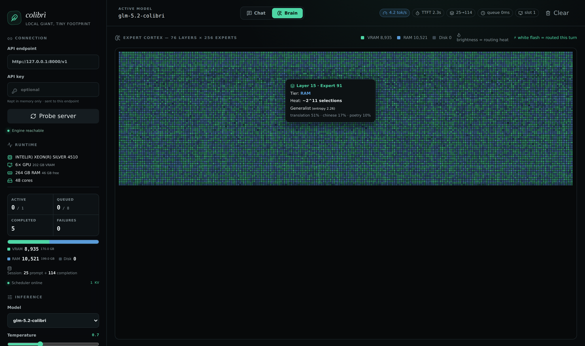

# Qwanto
Unified inference runtime that uses all your hardware — CPU, GPU, RAM, NVMe — to run any model larger than memory.
<p align="center">
  
</p>
<p align="center"><em>The <strong>Brain</strong> page: all experts as a living cortex — colour = storage tier (Disk/RAM/VRAM), brightness = routing heat, white flash = routed this turn. Hover shows measured topic affinity.</em></p>

# Qwanto (formerly Colibrì)

> **Note:** Project name is **Qwanto**; the CLI binary remains **`coli`** for backward compatibility.

**Unified inference runtime that uses all your hardware — CPU, GPU, RAM, NVMe — to run any model larger than memory.**

Qwanto is a measurement-driven inference platform. It doesn't assume GPU is faster. It benchmarks your actual hardware at startup (CPU throughput, memory bandwidth, PCIe latency, GPU compute, NVMe speed) and dynamically routes each operation to the fastest available tier. The same engine runs:

- **Native MoE models** (GLM-5.2, Qwen-MoE, DeepSeek-MoE, etc.) — streams experts from disk
- **Dense models via llama.cpp / Ollama / OpenAI-compatible endpoints** — unified API
- **Any GGUF / Safetensors model** — through the backend abstraction layer

```
┌─────────────────────────────────────────────────────────────────┐
│                        Clients                                   │
└──────────────────────────┬──────────────────────────────────────┘
                           ▼
              ┌────────────────────────────┐
              │  OpenAI-compatible API     │
              │  (SSE streaming, tools,    │
              │   structured output)       │
              └──────────────┬─────────────┘
                             ▼
              ┌────────────────────────────┐
              │  Python Orchestration      │
              │  (runtime, scheduling,     │
              │   backend routing)         │
              └──────────────┬─────────────┘
                             ▼
        ┌────────────────────┼────────────────────┐
        ▼                    ▼                    ▼
┌───────────────┐  ┌─────────────────┐  ┌─────────────────┐
│ Native Engine │  │   llama.cpp     │  │   Ollama /      │
│ (C, MoE/dense)│  │   (GGUF)        │  │   OpenAI API    │
└───────────────┘  └─────────────────┘  └─────────────────┘
        │                    │                    │
        └────────────────────┴────────────────────┘
                             ▼
              ┌────────────────────────────┐
              │  Hardware Abstraction      │
              │  CPU • GPU • RAM • NVMe    │
              │  Measured, not assumed     │
              └────────────────────────────┘
```

---

## What Actually Works Today

### Native Engine (C)
- **GLM-5.2 MoE forward pass** — token-parity validated vs. `transformers` (greedy, documented dataset)
- **MLA attention** — 576 floats/token KV cache (vs 32,768 standard)
- **Int4/Int8 kernels** — AVX2, AVX-512, NEON, VSX integer dot products
- **Expert streaming** — `pread` + `posix_fadvise` / `ReadFile` + overlapped I/O / `io_uring` (Linux)
- **LFRU expert cache** — frequency + recency, per-layer, survives restarts via `.qwanto_kv`
- **MTP speculative decoding** — native multi-token prediction head
- **GBNF grammar forcing** — JSON/NDJSON structure enforcement during draft
- **DSA sparse attention** — lightning indexing (NO-OP for short context)
- **Byte-level BPE tokenizer** — 320k merges, Unicode property regex

### Universal Backends (Python)
| Backend | Streaming | Tools | Structured Output | Models |
|---------|-----------|-------|-------------------|--------|
| Native | ✓ | ✓ | ✓ | MoE + dense |
| llama.cpp | ✓ | ✓ | ✓ | Any GGUF |
| Ollama | ✓ | ✗* | ✗* | Any Ollama model |
| OpenAI-compatible | ✓ | ✓ | ✓ | Any remote |

*Ollama tool support varies by model version.

### Web Dashboard (React + Tailwind)
- **Chat** with live tok/s, TTFT, queue wait, cache hit%
- **Brain**: interactive 76×256 expert cortex (native MoE only), hover for affinity/entropy
- **Models**: download, switch, delete models, manage search paths
- **Logs**: real-time error viewer with copy-to-clipboard
- **Resource Limits**: CPU/RAM/VRAM/Disk sliders with live control
- **Loading indicators**: animated progress bar, typing dots, "Generating..." badge
- **Persistent state**: tab, conversations, and settings survive page refresh
- Served on same port as API (`coli web`)

### Windows Native
- No WSL. MinGW-w64 build. Overlapped I/O, large-page mapping, NUMA-aware thread affinity (>64 logical processors).

---

## Web Dashboard Tabs

### Chat
- Send messages and stream responses in real-time
- Live performance metrics: tok/s, TTFT, queue wait
- Conversation persists across page refreshes
- Professional loading indicators during generation

### Brain
- Interactive expert cortex visualization for native MoE models
- Color = storage tier (VRAM green, RAM blue, Disk dark)
- Brightness = routing heat
- White flash = routed this turn
- Hover for topic affinity and entropy
- Shows "not available" message for GGUF models (expected)

### Models
- **Active Model Status**: see current model, path, backend
- **Resource Limits**: sliders for CPU%, RAM%, VRAM%, Disk I/O
- **Custom Model Path**: load any model by path
- **Discovered Local Models**: all models from search paths
- **Custom Search Paths**: add/remove folders to scan
- **Model Downloader**: parallel downloads with pause/resume/cancel

### Logs
- Real-time error and warning capture
- Console errors, unhandled rejections, API errors
- Color-coded: red (error), yellow (warn), green (info)
- **Copy All** button for sharing debugging info
- Timestamps on every entry

---

## Model Downloader

Built-in parallel download manager with full controls — no external tools needed.

### Features
- **8 parallel connections** by default for maximum download speed
- **Configurable connections**: 1 / 2 / 4 / 8 / 16 / 32
- **Speed limiter**: Unlimited, 5, 10, 20, 50, 100 MB/s
- **Pause / Resume / Cancel** any download
- **Auto-retry** on failure (3 attempts per chunk)
- **Live progress**: speed, downloaded/total, chunk progress
- **Path picker**: choose where to save the model
- **Auto-detect filename** from URL

### Download via UI
1. Go to the **Models** page
2. Paste a HuggingFace direct link or GGUF download URL
3. Optionally pick a save path (defaults to `models/`)
4. Click **Download** — progress shows instantly without page refresh
5. Use pause/resume/cancel as needed
6. Adjust connections and speed limit while downloading

### Download via API
```bash
# Start download
curl -X POST http://127.0.0.1:8000/v1/qwanto/download \
  -H "Content-Type: application/json" \
  -d '{"url": "https://huggingface.co/.../model.gguf", "dest_path": "D:/models/"}'

# Check status
curl http://127.0.0.1:8000/v1/qwanto/download/status

# Configure connections and speed
curl -X POST http://127.0.0.1:8000/v1/qwanto/download/config \
  -H "Content-Type: application/json" \
  -d '{"connections": 16, "speed_limit": 0}'

# Pause
curl -X POST http://127.0.0.1:8000/v1/qwanto/download/pause

# Resume
curl -X POST http://127.0.0.1:8000/v1/qwanto/download/resume

# Cancel
curl -X POST http://127.0.0.1:8000/v1/qwanto/download/cancel
```

---

## Model Management

### Active Model Switching
- View all discovered local models in the **Models** page
- See which model is currently **Active** (green indicator)
- Click **Switch** on any model to load it instantly
- The server reloads the backend and the UI updates automatically

### Multi-Path Model Discovery
Models are discovered from 5 sources:
1. `qwanto/models/` (project default)
2. Active model's parent directory
3. Download destination directory
4. `QWANTO_MODEL_PATHS` env var (semicolon-separated)
5. Custom paths added via UI or API

### Delete Models
- Click the trash icon on any discovered model
- Confirmation dialog prevents accidental deletion
- Deletes the model file or directory from disk

### Resource Limits
Control hardware usage with sliders in the Models page:
- **CPU Threads**: 10-100% (shows actual thread count)
- **RAM Cache**: 5-100% (shows actual GB)
- **GPU (VRAM)**: 0-100% (0% = GPU disabled, warning shown)
- **Disk I/O**: 10-100%

Settings persist across page refreshes and apply on next model load.

---

## API Endpoints

| Endpoint | Method | Description |
|----------|--------|-------------|
| `/v1/chat/completions` | POST | OpenAI-compatible chat (streaming) |
| `/v1/completions` | POST | OpenAI-compatible completion |
| `/v1/models` | POST | List available models |
| `/health` | GET | Health check + hardware info |
| `/v1/qwanto/load` | POST | Load a model: `{"model_path": "...", "backend": "auto"}` |
| `/v1/qwanto/config` | GET | Current config: model, backend, resources, capabilities |
| `/v1/qwanto/models` | GET | List discovered local models + search paths |
| `/v1/qwanto/paths` | GET/POST | Get/add/remove custom model search paths |
| `/v1/qwanto/resources` | GET/POST | Get/set resource limits (CPU%, RAM%, VRAM%, Disk%) |
| `/v1/qwanto/download` | POST | Start download: `{"url": "...", "dest_path": "..."}` |
| `/v1/qwanto/download/status` | GET | Download progress, speed, chunks |
| `/v1/qwanto/download/pause` | POST | Pause active download |
| `/v1/qwanto/download/resume` | POST | Resume paused download |
| `/v1/qwanto/download/cancel` | POST | Cancel and delete partial file |
| `/v1/qwanto/download/config` | POST | Set connections/speed limit |
| `/v1/qwanto/delete` | POST | Delete model: `{"path": "..."}` |

### Response Headers
All responses include:
- `x-qwanto-engine`: active backend name
- `x-qwanto-queue-wait-ms`: time spent in queue
- `x-qwanto-cache-hit`: KV cache hit (1 or 0)

---

## Honest Performance Numbers

### GLM-5.2 (744B MoE, int4) — Single Request Decode

| Hardware | Config | tok/s (warm) | Cold tok/s |
|----------|--------|--------------|------------|
| 6× RTX 5090 (32GB) + 256GB RAM | Experts across VRAM+RAM | **6.84** | 0.05–0.1 |
| 1× RTX 4090 (24GB) + 64GB RAM | VRAM hot experts, RAM warm, NVMe cold | ~2.1 | 0.05–0.1 |
| CPU only (EPYC 9354, 256GB RAM) | RAM cache + NVMe | ~0.8 | 0.05–0.1 |
| CPU only (Ryzen 9 7950X, 64GB RAM) | RAM cache + NVMe | ~0.4 | 0.03–0.08 |

**Memory breakdown (744B @ int4, 4k context, batch=1):**
- Dense weights (resident): ~9.9 GiB
- KV cache (MLA compressed): ~0.68 GiB
- Expert cache (LFRU, configurable): ~8 GiB default
- Runtime buffers: ~0.9 GiB
- **Peak RSS: ~20 GiB** with `RAM_GB=20`

**Cold start reality:** First token after cache miss = 10–20s (11 GiB random NVMe reads). Not a bug — physics of 370 GiB model on consumer NVMe.

---

## Quick Start

### 1. Get a Model
**GLM-5.2 int4 (pre-converted):**
```
https://huggingface.co/mateogrgic/GLM-5.2-colibri-int4-with-int8-mtp
```
Or download via the built-in model downloader in the web UI.

Or convert any Safetensors MoE yourself:
```bash
cd c
./coli convert --model /path/to/model --ebits 4 --io-bits 8
```

### 2. Build & Run
```bash
# Linux / macOS / WSL
cd c
./setup.sh                    # deps, build, self-test
./coli web --model /path/to/model --ram 20

# Windows (PowerShell)
cd c
.\coli build                  # or: make -C ..\c glm
.\coli web --model D:\models\glm52_i4 --ram 20
```

Or use the batch file:
```batch
run_server.bat
```

### 3. Open Dashboard
```
http://127.0.0.1:8000/
```
API also available at `http://127.0.0.1:8000/v1` (OpenAI-compatible).

---

## Configuration

All via environment variables or CLI flags:

| Variable | CLI | Default | Description |
|----------|-----|---------|-------------|
| `QWANTO_MODEL` | `--model` | *required* | Model directory or GGUF path |
| `QWANTO_API_KEY` | `--api-key` | — | API key for auth |
| `QWANTO_HOST` | `--host` | `0.0.0.0` | Bind address |
| `QWANTO_PORT` | `--port` | `8000` | Server port |
| `QWANTO_NO_OMP_TUNE` | — | `0` | Disable OpenMP tuning |
| `QWANTO_MODEL_PATHS` | — | — | Semicolon-separated extra model directories |
| `RAM_GB` | `--ram` | 88% of available | RAM budget for expert cache |
| `QWANTO_GPUS` | `--gpu` | `auto` | GPU devices: `auto`, `none`, `0,1` |
| `CUDA_EXPERT_GB` | `--vram` | auto | VRAM budget for hot experts |
| `QWANTO_POLICY` | `--policy` | `quality` | `quality` \| `balanced` \| `experimental-fast` |
| `TOPP` / `TOPK` | `--topp` / `--topk` | 0.95 / 0 | Router sampling |
| `REPIN` | `--repin` | 0 | Re-pin VRAM/RAM experts every N tokens |
| `CTX` | `--ctx` | 4096 | Context length |
| `NGEN` | `--ngen` | 1024 | Max output tokens |
| `KV_SLOTS` | `--kv-slots` | 1 | Conversation slots (isolated KV caches) |
| `DIRECT=1` | — | Windows default | O_DIRECT I/O (bypass page cache) |
| `PIPE=1` | — | Windows default | Overlapped load/compute pipeline |
| `PILOT_REAL=1` | — | Windows default | Cross-layer async prefetch |

**Auto-tiering (recommended):**
```bash
./coli web --model /path/to/model --auto-tier --ram 20 --gpu auto --vram 16
```
This runs the resource planner, detects hardware, and sets optimal env vars automatically.

---

## Using Other Models

### Via llama.cpp (GGUF)
```bash
./coli web --model /path/to/model.gguf --backend llama.cpp
# or set QWANTO_MODEL=model.gguf and it auto-detects
```

llama-server is launched with optimal settings:
- All physical CPU cores (`-t <cores>`)
- 512 batch size (`-b 512 -ub 512`)
- 4096 context (`--ctx-size 4096`)
- 2 parallel slots (`--parallel 2`)
- All layers offloaded to GPU (`-ngl 999`)

### Via Ollama
```bash
./coli web --model llama3.1:70b --backend ollama
```

### Via Remote OpenAI-compatible
```bash
./coli web --model gpt-4o --backend openai --backend-url https://api.openai.com/v1 --api-key $OPENAI_KEY
```

The CLI auto-detects backend from model path/name. Override with `--backend native|llama.cpp|ollama|openai|auto`.

---

## Project Structure

```
qwanto/
├── c/                          # Native engine (C)
│   ├── glm.c                   # MoE forward, kernels, scheduler
│   ├── st.h / compat.h         # Safetensors I/O, cross-platform shim
│   ├── tok.h / tok_unicode.h   # Byte-level BPE tokenizer
│   ├── grammar.h               # GBNF parser + PDA walker
│   ├── sched.h                 # Measurement-driven router
│   ├── tier.h                  # LFRU cache policy
│   ├── openai_server.py        # HTTP gateway + SSE + download manager + resource API
│   ├── backends.py             # Backend abstraction layer
│   ├── resource_plan.py        # HW detection + tier budgeting + CPU count
│   ├── doctor.py               # Read-only diagnostics
│   ├── download_fp8.py         # Download helper
│   ├── coli                    # Python CLI (entry point)
│   └── Makefile                # Multi-platform build
├── web/                        # React dashboard
│   ├── src/App.tsx             # Main UI — chat, models, logs, resources
│   ├── src/Brain.tsx           # Expert cortex canvas
│   ├── src/index.css           # Tailwind + custom styles
│   └── src/lib/api.ts          # API client (all endpoints)
├── run_server.bat              # Windows launcher
├── flake.nix                   # Nix flake for reproducible builds
├── docs/                       # Architecture, benchmarks, manifests
└── tests/                      # Python test suite (82 tests)
```

---

## Troubleshooting

### Model not responding / stuck on "Generating..."
1. Check the **Logs** tab for error messages
2. Ensure `llama-server` is installed and in PATH
3. Restart the server: `python -m coli web --model <path>`
4. Set VRAM to ≥ 25% (not 0%) to enable GPU acceleration

### `WinError 4551` — Application Control policy blocked
Windows AppLocker/WDAC is blocking `llama-server.exe`. Solutions:
1. Start llama-server manually: `llama-server -m <model> -ngl 999 --port 8080`
2. Use `--backend-url http://127.0.0.1:8080` to connect
3. Contact admin to allow llama-server in AppLocker policy

### CPU not being utilized
Ensure you restarted the server after the latest update. llama-server now uses all physical CPU cores by default.

### `Failed to fetch models from llama-cpp`
The llama.cpp backend couldn't reach llama-server. The server will still work — try loading the model again.

### Download stuck at 0%
Check that the URL is a direct download link (not a webpage). HuggingFace links should end with `?download=true`.

### Model not appearing after download
The discovered models list refreshes every 5 seconds. Add custom search paths in the Models page if your download directory isn't auto-detected.

### Conversation lost on refresh
Conversations are now persisted in localStorage. If lost, check browser storage settings.

---

## License

Apache 2.0. GLM-5.2 weights by Z.ai under MIT.

---

## Status

**Works:** GLM-5.2 MoE native, llama.cpp GGUF, Ollama, OpenAI-compatible backends, Windows/Linux/macOS, web dashboard (Chat/Brain/Models/Logs tabs), tool calls, grammar forcing, KV persistence, speculative decoding, parallel model downloads (8 connections), active model switching, download pause/resume/cancel, resource limits (CPU/RAM/VRAM/Disk), multi-path model discovery, persistent conversations, real-time error logs, professional loading indicators.

**Limitations:** 
- Cold expert streaming is disk-bound (10–20s/token first hit)
- No multi-GPU expert parallelism yet (single GPU or CPU)
- Ollama tool calling unreliable
- No AMD ROCm / Intel XPU backend (CUDA or CPU only)
- Model conversion only supports GLM-style MoE safetensors currently
- Expert Cortex (Brain tab) only works with native MoE models, not GGUF

**Not vaporware:** Ships a working binary, passing tests (82 Python + 17 web), measurable numbers.

---

## GitHub Topics

`llm-inference` `moe-models` `c-engine` `cuda` `llama-cpp` `local-llm` `disk-offloading` `measurement-driven` `speculative-decoding` `grammar-constrained` `openai-compatible` `windows-native` `model-downloader` `parallel-download` `resource-management` `real-time-logs`
