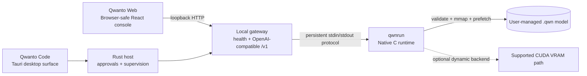

<p align="center">
  
</p>

<p align="center">
  <a href="https://github.com/SaifHu98/Qwanto/actions/workflows/ci.yml"></a>
  <a href="https://github.com/SaifHu98/Qwanto/releases"></a>
  <a href="LICENSE"></a>
</p>

# Qwanto Native — Local AI Runtime, QWN Format, Web Console, and Coding Agent

Qwanto Native combines a native runtime, validated `.qwn` containers, a local
gateway, Qwanto Web, and Qwanto Code.

## Native Engine Highlights

- **Native C runtime:** `qwnrun` opens validated QWN containers, runs the
  decoder, and exposes a persistent line-oriented `--serve` protocol for the
  gateway and desktop host.
- **Validated container boundary:** the loader checks QWN metadata, tensor
  counts, descriptor bounds, payload bounds, and supported dtypes before
  inference. The implemented layout has a 4 KiB header, 64-byte tensor
  payload padding, and a tail-block offset recorded by the converter.
- **Native execution paths:** target-specific SIMD kernels are compiled for
  supported CPU targets. HyperVSQ-2 and Q4_0 paths are exercised by native
  tests; TWLA, LittleBit, and TurboQuant remain explicitly scoped to their
  implemented/tested kernel or KV paths until complete model evidence exists.
- **Memory-aware runtime:** the QWN loader uses memory mapping and layer-ahead
  prefetching. CPU/RAM/NVMe residency planning is implemented; CUDA execution
  is reported only when a compatible `qwn_cuda.dll` completes a supported
  matmul on the selected device.
- **Loopback gateway:** `c/openai_server.py` serves local health, model,
  telemetry, and OpenAI-compatible `/v1` endpoints. It supervises the native
  process and binds to loopback by default.
- **Model lifecycle:** the local registry, converter, validator, acquisition
  flow, and measured telemetry keep model provenance explicit. A model is not
  activated from a filename alone.
- **Qwanto Code boundary:** the Tauri desktop surface adds approval-gated
  workspace tools, files, diffs, skills, plugins, and project memory around
  the shared runtime.
- **No bundled weights:** installers contain runtime resources only. Users
  import or download model files explicitly; no model weights are shipped.

## Verified Performance Evidence

Performance claims are evidence claims, not product slogans. The current
native record is a real local `qwnrun` run of the 4B HyperVSQ-2 QWN fixture:

| Model | Source Format | QWN Quantization | File Size | Bits/Weight if known | RAM / VRAM Measurement | TTFT | Tokens/s | Hardware | Evidence Class |
| --- | --- | --- | --- | --- | --- | --- | --- | --- | --- |
| DeepSeek-V4-Pro-Qwen3.5-4B-HyperVSQ2 | QWN container | HyperVSQ-2 | 1.18 GiB (1,266,202,104 bytes) | 2.34028 bpw | Unavailable | Unavailable | 7.148571 | Windows 11; AMD64 Family 26 Model 68; NVIDIA GeForce RTX 5070 Ti Laptop GPU | MEASURED native `qwnrun` |

This row is valid only for the recorded executable hash, model hash, prompt,
token limit, and host. It is not a universal throughput claim. The full
machine-readable evidence and generator are in
[`docs/performance.md`](docs/performance.md),
[`docs/performance-report.json`](docs/performance-report.json), and
[`benchmarks/generate_performance_report.py`](benchmarks/generate_performance_report.py).
Unknown values remain `Unavailable`; the report never substitutes zeros,
host guesses, or projections. Archived GGUF/`llama-server` measurements are
kept in a separate `EXPERIMENTAL_EXTERNAL` section for provenance only; GGUF
is not an executable Qwanto runtime format.

## QWN Quantization and Container Formats

QWN is a validated native container, not only a file extension. Its layout
and validation rules are documented in
[`docs/qwn-format.md`](docs/qwn-format.md):

- a 4 KiB header with tensor and payload metadata;
- 64-byte-aligned tensor payload blocks for predictable native access;
- descriptor and payload bounds validation before a tensor is used;
- memory-mapped loading with prefetch hooks;
- explicit dtype IDs for FP32, FP16, Q4_0, HyperVSQ-2, TWLA 1.58-bit, and
  TurboQuant where the implementation supports them.

The current evidence distinguishes formats precisely:

| Format | Current status | Trade-off |
| --- | --- | --- |
| FP32 / FP16 | Implemented container dtypes; no current performance row | Precision and compatibility at a larger memory footprint. |
| Q4_0 | Implemented and container-validated; no matching native inference row in the current report | Conventional 4-bit compression; speed and quality require same-host measurement. |
| HyperVSQ-2 | Validated conversion and measured native QWN evidence | Lower storage and memory pressure; model quality and speed remain workload-dependent. |
| TWLA 1.58-bit | Implemented/tested kernel path; no complete model evidence | Experimental sub-2-bit path, not a model-level claim. |
| LittleBit | Implemented/tested library path, not a QWN dtype | Low-rank binary factors trade representation size against approximation error. |
| TurboQuant | Implemented/tested KV path; no complete model evidence | Low-bit KV-cache storage trades capacity against approximation behavior. |

Conversion MB/s is not inference tokens/s. Different model sizes, hosts,
backends, token limits, and runtime hashes must not be compared as though they
were one benchmark.

## Product Surfaces

Qwanto Native is the umbrella product. Qwanto Code is its desktop coding-agent
surface, not an unrelated product:

```text
Qwanto Native
├── Native Runtime
│   ├── qwnrun
│   ├── .qwn format
│   ├── quantization and validation
│   └── local OpenAI-compatible gateway
├── Qwanto Web
│   └── safe browser console for local chat and model status
└── Qwanto Code
    └── desktop coding agent with workspace, files, diffs, approvals, skills, plugins, and project memory
```

Qwanto Web is a safe browser client. It can call the configured local HTTP
gateway for chat and model status, but it cannot read arbitrary files, execute
tools, launch subprocesses, or access Tauri commands. Qwanto Code is the
desktop agent surface and shares the native runtime with Qwanto Web. Internet
search and GitHub integration are optional, explicit external opt-ins;
inference remains local-first.

## Architecture



The gateway owns runtime lifecycle and structured telemetry. The desktop host
owns privileged workspace operations and approval tokens. The browser never
inherits those privileges.

## Qwanto Code

Qwanto Code keeps the coding workspace small and focused: **Project, Chats,
Files, Changes, Settings**. Its top controls expose model selection,
Plan/Agent mode, start/stop, gateway state, and compact runtime settings.

The desktop surface provides:

- validated local model library actions, focused conversion/download dialogs,
  activation only after QWN metadata and hardware-fit checks;
- Fast, Balanced, and Deep profiles mapped only to supported runtime
  parameters such as context, maximum output, and sampling. CPU threads,
  GPU offload, KV mode, batching, and speculative decoding remain unavailable
  until the runtime reports an implementation;
- live prompt/completion/total token, TTFT, tokens/s, elapsed, context, tool,
  and queue metrics, with `Unavailable` for metrics not reported by runtime;
- workspace-safe attachments with previews, size limits, explicit removal,
  and model capability checks;
- editable local project memory, checkpoints, resume support, export, clear,
  and per-project disable controls;
- local built-in skills invoked with `@skill-name`, capability-declared
  plugins disabled by default, approval tokens, containment, redaction, and
  fail-closed third-party execution;
- optional GitHub and web-search skills that require explicit approval for
  external access and repository writes.

## Model lifecycle

1. Import or download a user-managed source model with explicit consent.
2. Convert it to QWN when the selected architecture and quantization are
   supported; conversion writes atomically and records evidence.
3. Validate the container, metadata, tensor bounds, hash, and host fit.
4. Review the model in Settings and explicitly activate the validated model.
5. Start the shared loopback gateway and persistent `qwnrun` service on demand.
6. Run local Web or Code sessions while telemetry and approvals remain visible.

Installers never contain model weights. GGUF, Safetensors, and PyTorch files
are source artifacts only; they must be converted and validated into QWN
before qwnrun, the gateway, or Qwanto Code can activate them. There is no
llama-server, Ollama, cloud, or other external inference fallback.

## Installation and quick start

### Native runtime and gateway

Build the native runtime with the supported toolchain:

```sh
make -C c qwnrun
```

Inspect a local QWN container before use:

```sh
python c/coli inspect experiments/results/4B_hyper_vsq2.qwn
```

Run a persistent native service (the gateway normally supervises this for
you):

```sh
c/qwnrun experiments/results/4B_hyper_vsq2.qwn --serve
```

Start the local gateway and shared Web console with a user-managed model:

```sh
python c/openai_server.py --model experiments/results/4B_hyper_vsq2.qwn
cd web
npm ci
npm run dev
```

The browser development server is only the frontend. The gateway is the local
API boundary and is normally reached at loopback.

### Qwanto Code development shell

```sh
make -C c qwnrun
mkdir -p desktop/src-tauri/resources
cp c/qwnrun desktop/src-tauri/resources/qwnrun
cd web && npm ci && npm run build
cd ../desktop
cargo tauri dev
```

See [`desktop/README.md`](desktop/README.md) for Windows staging and Rust
validation commands. Release installers are produced by the tag workflow;
they include runtime resources but no models.

## Security and local-first boundaries

- The gateway binds to loopback by default and preserves HTTP defense headers;
  bearer authentication is opt-in through the documented environment
  contract.
- Qwanto Web is unprivileged. File access, command execution, edits, commits,
  and process supervision remain in Qwanto Code behind approvals.
- Project memory, attachments, plugin settings, and diagnostics remain local
  by default. Secrets are kept out of logs and exported bundles are redacted.
- Internet search, GitHub access, external runtimes, and downloads are
  opt-in tools, not cloud inference fallbacks. Each external or destructive
  action requires clear approval.
- Plugins declare capabilities, remain disabled by default, and are not
  executed unless a future sandbox/supervisor and trust policy allow them.
- The unsigned Beta.4 release, when published, is not a signed or
  production-ready release. Windows SmartScreen and macOS Gatekeeper may
  warn; verify the attached SHA-256 checksums before installing.

## Documentation map

- [QWN performance and quantization](docs/performance.md)
- [Generated performance evidence](docs/performance-report.md)
- [QWN container format](docs/qwn-format.md)
- [Benchmark methodology](docs/benchmark-methodology.md)
- [Architecture](docs/architecture.md)
- [API and gateway contract](docs/api.md)
- [Desktop agent boundary](docs/desktop-agent.md)
- [Skills and plugins](docs/skills-and-plugins.md)
- [Web UI safety boundary](docs/web-ui.md)
- [Security model](docs/security-model.md)
- [Local-only behavior](docs/local-only.md)
- [Conversion and acquisition](docs/conversion.md)
- [Packaging and conditional signing](docs/packaging.md)
- [Release engineering](docs/release-engineering-plan.md)
- [Release readiness](RELEASE_READINESS.md)

The approved Qwanto Native mark is sourced from
[`assets/brand/qwanto-icon.png`](assets/brand/qwanto-icon.png). Platform and
Web mirrors are checked by `c/tools/check_brand_assets.py`; no alternate
lettermark is part of the supported product identity.
