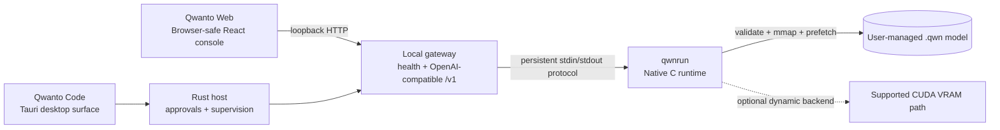

<p align="center">
  
</p>

<p align="center">
  <a href="https://github.com/SaifHu98/Qwanto/actions/workflows/ci.yml"></a>
  <a href="https://github.com/SaifHu98/Qwanto/releases"></a>
  <a href="LICENSE"></a>
</p>

# Qwanto Native — Local AI Runtime, QWN Format, Web Console, and Coding Agent

Qwanto Native combines a native runtime, validated `.qwn` containers, a local
gateway, Qwanto Web, and Qwanto Code.

## Native Engine Highlights

- **Native C runtime:** `qwnrun` opens validated QWN containers, runs the
  decoder, and exposes a persistent line-oriented `--serve` protocol for the
  gateway and desktop host.
- **Validated container boundary:** the loader checks QWN metadata, tensor
  counts, descriptor bounds, payload bounds, and supported dtypes before
  inference. The implemented layout has a 4 KiB header, 64-byte tensor
  payload padding, and a tail-block offset recorded by the converter.
- **Native execution paths:** target-specific SIMD kernels are compiled for
  supported CPU targets. HyperVSQ-2 and Q4_0 paths are exercised by native
  tests. Native NextN/MTP speculation now has checkpoint/restore and factual
  acceptance counters, while target verification remains sequential and is not
  presented as a speedup.
- **Memory-aware runtime:** the QWN loader uses memory mapping and layer-ahead
  prefetching. CPU/RAM/NVMe residency planning is implemented; CUDA execution
  is reported only when a compatible `qwn_cuda.dll` completes a supported
  matmul on the selected device.
- **Loopback gateway:** `c/openai_server.py` serves local health, model,
  telemetry, and OpenAI-compatible `/v1` endpoints. It supervises the native
  process and binds to loopback by default.
- **Model lifecycle:** the local registry, converter, validator, acquisition
  flow, and measured telemetry keep model provenance explicit. A model is not
  activated from a filename alone.
- **Qwanto Code boundary:** the Tauri desktop surface adds approval-gated
  workspace tools, files, diffs, skills, plugins, and project memory around
  the shared runtime.
- **No bundled weights:** installers contain runtime resources only. Users
  import or download model files explicitly; no model weights are shipped.

## Verified Performance Evidence

Performance claims are evidence claims, not product slogans. This table is
generated from `benchmark_evidence.json`,
`benchmarks/evidence/windows/2026-08-22/*.json`,
`benchmarks/benchmark_matrix.json`, and the checked-in model manifest.
The two real local CPU rows are the validated 4B HyperVSQ-2 QWN fixture and
the 1.5B Q4_0 fixture converted from a DeepSeek-R1-Distill-Qwen GGUF source:

| Model | Native QWN Format | Size | Backend Actually Used | Decode tok/s | TTFT | Evidence Class | Reproduce |
| --- | --- | --- | --- | ---: | ---: | --- | --- |
| DeepSeek-V4-Pro-Qwen3.5-4B-HyperVSQ2 | QWN container (HyperVSQ-2) | 1.18 GiB | CPU (avx-vnni) | 8.154199 | Unavailable | MEASURED | [`docs/performance-report.md`](docs/performance-report.md) |
| DeepSeek-V4-Pro-Qwen3.5-4B-HyperVSQ2 | QWN container (HyperVSQ-2) | 1.18 GiB | CPU (vnni, 8 threads) | 8.784 | Unavailable | MEASURED | [`4b_hyper_vsq2_cpu_128_for_compare.json`](benchmarks/evidence/windows/2026-08-22/4b_hyper_vsq2_cpu_128_for_compare.json) |
| DeepSeek-V4-Pro-Qwen3.5-4B-HyperVSQ2 | QWN container (HyperVSQ-2) | 1.18 GiB | CUDA (RTX 5070 Ti, hypervsq2-74-q8-reference) | 8.216 (128 tok) | Unavailable | MEASURED | [`4b_hyper_vsq2_cuda_128.json`](benchmarks/evidence/windows/2026-08-22/4b_hyper_vsq2_cuda_128.json) |
| DeepSeek-R1-Distill-Qwen-1.5B-Q4_0 | QWN container (Q4_0) | 959.86 MiB | CPU | 1.718469 (64 tok) | 6556 ms | MEASURED | [`1.5b_q4_0_64tok.json`](benchmarks/evidence/windows/2026-08-22/1.5b_q4_0_64tok.json) |
| DeepSeek-R1-Distill-Qwen-1.5B-Q4_0 | QWN container (Q4_0) | 959.86 MiB | CPU | 2.474 (128 tok, 8 threads) | Unavailable | MEASURED | [`1.5b_q4_0_128tok_cpu.json`](benchmarks/evidence/windows/2026-08-22/1.5b_q4_0_128tok_cpu.json) |

Each row is valid only for the recorded executable hash, model hash, prompt,
context, seed, token limit, threads, and host. They are not universal
throughput claims.

### 2026-08-28 local model audit

The following audit used the current source tree and a temporary Windows Clang
`qwnrun` binary (`SHA-256 c6e0f2d781b6b374bac0398e569bccf6145e3046f34cd6a5019643d0bd965ba2`).
It used CPU, `top_p=1`, temperature `0`, context `2048`, and one cold process
per row. These are diagnostic measurements, not release-quality benchmark
rows: the temporary binary was not built with OpenMP or release ISA flags.

| Local artifact tested | Format | File size | Prompt tokens | Generated | Prefill tok/s | Decode tok/s | Actual backend/kernel | Result |
| --- | --- | ---: | ---: | ---: | ---: | ---: | --- | --- |
| DeepSeek-R1-Distill-Qwen 1.5B | QWN Q4_0 | 1,006,483,816 B | 6 | 16 | 0.915259 | 0.924933 | CPU / scalar | `status=ok` |
| DeepSeek-V4-Pro-Qwen3.5 4B | QWN BF16 (baseline) | 8,655,205,784 B | 12 | 8 | 0.305899 | 0.299913 | CPU / scalar | `status=ok` |
| DeepSeek-V4-Pro-Qwen3.5 4B | QWN HyperVSQ-2 | 1,266,202,104 B | 12 | 8 | 0.472111 | 0.430528 | CPU / scalar | `status=ok` |

The factual timing values are retained here only to make the local run
reproducible; no cross-model or hardware-general speed claim follows from them.

The corresponding runtime resource plan reported planned NVMe-backed bytes of
`1,006,082,432` for the 1.5B Q4_0 artifact, `8,654,655,040` for the 4B BF16
baseline, and `1,265,610,304` for 4B HyperVSQ-2. These are runtime telemetry
values for those processes, not peak-RSS measurements.

| Source → QWN conversion | Source size | QWN size | Size change | Conversion throughput |
| --- | ---: | ---: | ---: | ---: |
| DeepSeek-R1 1.5B Q4_K_M → Q4_0 | 1,117,320,800 B | 1,006,483,816 B | -9.92% | 1,264.792 MB/s |
| DeepSeek-V4-Pro 4B BF16 → baseline | 8,665,621,152 B | 8,655,205,784 B | -0.12% | 542.507 MB/s |
| DeepSeek-V4-Pro 4B BF16 → HyperVSQ-2 | 8,665,621,152 B | 1,266,202,104 B | -85.38% | 63.157 MB/s |

The model-directory audit found that only the 4B artifact is a genuine
HyperVSQ-2 QWN model. The 1.5B files labelled `none` and `hyper_vsq2` have
the same hash/size and contain Q4-compatible payloads, so they are not counted
as HyperVSQ-2. The `15B_none.qwn` file has the same 1.5B parameter metadata and
is not counted as a third model. Qwen3.8/Flash-Next sources remain separate
conversion gates because of mixed IQ/K layouts, MTP/DeltaNet coverage, and
Flash-Next multi-shard handling; no fabricated HyperVSQ-2 row is added for
them.

The current real Qwen3.8 fixed QWN artifact also passed a one-token native MTP
speculative check: `NATIVE_MTP_COMPLETED`, one proposal, one rejection, and
greedy output `2`, matching ordinary target-only generation. This is a
correctness check, not a speed or quality benchmark.

On RTX 5070 Ti Laptop with the current `qwn_cuda.dll` ABI 1 (74-byte
HyperVSQ-2 reference path), the CUDA execution reports
`backend_actual=cuda` with `gpu_matmul_count=11264` and `cpu_fallback_count=0`
at 128 tokens, but the CUDA reference path produces `8.216 tok/s` while the
local CPU VNNI path produces `8.784 tok/s` for the same model and prompt
(CUDA 5.9% slower at 128 tokens on this hardware). The CUDA ABI supports
HYPER_VSQ2 only — a CUDA attempt on the 1.5B Q4_0 model fails closed
(`benchmarks/evidence/windows/2026-08-22/1.5b_q4_0_cuda_attempt.json` /
`1.5b_cuda_probe.log`) with `rc=-1` and `layer 0 attn matmul failed`. A
release-quality Q4_K / Q5_K / Q6_K CUDA path is not implemented and is
tracked under `docs/dtype-support-roadmap.md` Phase 1.

The full machine-readable evidence and generators are in
[`docs/performance.md`](docs/performance.md),
[`docs/performance-report.json`](docs/performance-report.json),
[`docs/model-manifest.json`](docs/model-manifest.json),
[`benchmarks/benchmark_matrix.json`](benchmarks/benchmark_matrix.json),
[`docs/qwn-supported-quantizations.md`](docs/qwn-supported-quantizations.md),
[`benchmarks/generate_performance_report.py`](benchmarks/generate_performance_report.py).
Unknown values remain `Unavailable`; the report never substitutes zeros,
host guesses, or projections. Archived GGUF/`llama-server` measurements are
kept in a separate `EXPERIMENTAL_EXTERNAL` section for provenance only;
GGUF is not an executable Qwanto runtime format.

### Runtime Feature Status

| Capability | Status | Evidence |
| --- | --- | --- |
| FP32 / FP16 / BF16 | Implemented container dtypes; no current performance row | [`docs/qwn-format.md`](docs/qwn-format.md), [`docs/qwn-supported-quantizations.md`](docs/qwn-supported-quantizations.md) |
| Q8_0 | Implemented container dtype; no current performance row | [`docs/qwn-format.md`](docs/qwn-format.md) |
| Q4_0 | Measured native CPU row (1.5B) | [`benchmark_matrix.json`](benchmarks/benchmark_matrix.json) |
| VSQ / VSQ_ULTRA / HYPER_VSQ | Experimental/reference only; local reference matrix only | [`docs/qwn-supported-quantizations.md`](docs/qwn-supported-quantizations.md) |
| HyperVSQ-2 CPU kernel | Measured native CPU result (4B) | [`benchmark_matrix.json`](benchmarks/benchmark_matrix.json) |
| HyperVSQ-2 CUDA kernel | Compiled and ABI-1 dispatched on detected sm_120 RTX 5070 Ti; no end-to-end Q4_0 model path is wired through it, so the Q4_0 CUDA attempt fails closed and the 4B HyperVSQ-2 local CUDA record remains diagnostic only. | [`docs/cuda-hypervsq2-design.md`](docs/cuda-hypervsq2-design.md) |
| TWLA / LittleBit-2 / TurboQuant | Reference/experimental only; no end-to-end QWN evidence | [`docs/qwn-format.md`](docs/qwn-format.md), [`docs/qwn-supported-quantizations.md`](docs/qwn-supported-quantizations.md) |
| JetSpec / SlimInfer / BitDecoding | Reference/experimental only | [`docs/qwn-supported-quantizations.md`](docs/qwn-supported-quantizations.md) |

`TWLA`, `LittleBit-2`, `TurboQuant`, `JetSpec`, `SlimInfer`, and `BitDecoding`
exist as decoder implementations or framework modules under `c/qwanto_*.c`
that are compiled into `qwnrun` via the Makefile `QWNRUN_SRCS` list but are
not exercised on any current measured native-inference path. Their dtype IDs
are not present in the `.qwn` container envelope, so they cannot appear in a
published `.qwn` performance row without first adding the corresponding
`QWN_DT_*` enum entry and reader. See
[`docs/dtype-support-roadmap.md`](docs/dtype-support-roadmap.md) for the
planned expansion.

### How to reproduce

Both rows above are reproduced end-to-end by the same harness:

```powershell
# 4B HyperVSQ-2 row (the canonical CPU record)
python benchmarks/benchmark_reproducible.py --model experiments/results/4B_hyper_vsq2.qwn --executable c/qwnrun.exe --backend cpu --context-size 4096 --max-tokens 64 --seed 0 --warmup-tokens 8 --output benchmark_evidence.json

# 1.5B Q4_0 rows (require the converted .qwn in models/qwn/, generated from the GGUF source via `python c/tools/qwn_convert.py convert --quant q4_0`)
python benchmarks/benchmark_reproducible.py --model "models/qwn/DeepSeek_R1_Distill_Qwen_1.5B_Q4_0.qwn" --executable c/qwnrun.exe --backend auto --context-size 2048 --max-tokens 64 --seed 0 --warmup-tokens 4 --output "benchmarks/evidence/windows/2026-08-22/1.5b_q4_0_64tok.json"
python benchmarks/benchmark_reproducible.py --model "models/qwn/DeepSeek_R1_Distill_Qwen_1.5B_Q4_0.qwn" --executable c/qwnrun.exe --backend cpu --threads 8 --context-size 2048 --max-tokens 128 --seed 0 --warmup-tokens 8 --output "benchmarks/evidence/windows/2026-08-22/1.5b_q4_0_128tok_cpu.json"

# Roll up the matrix and the rendered report (pass every evidence file you want to keep)
python benchmarks/generate_benchmark_matrix.py --evidence benchmark_evidence.json --evidence benchmarks/evidence/windows/2026-08-22/1.5b_q4_0_64tok.json --evidence benchmarks/evidence/windows/2026-08-22/1.5b_q4_0_128tok_cpu.json
python benchmarks/generate_performance_report.py --evidence benchmark_evidence.json --evidence benchmarks/evidence/windows/2026-08-22/1.5b_q4_0_64tok.json --evidence benchmarks/evidence/windows/2026-08-22/1.5b_q4_0_128tok_cpu.json --manifest docs/model-manifest.json
```

Replace `-DD-CRT_SECURE_NO_WARNINGS` / `--thinking none` etc. with the actual
flags emitted by the rows above if your local `qwnrun.exe` does not recognise
the same switches.

Research citations and projections are intentionally separate from measured
results. A referenced paper is not an integrated Qwanto feature until code,
tests, an end-to-end model path, and measured evidence exist.

## QWN Quantization and Container Formats

QWN is a validated native container, not only a file extension. Its layout
and validation rules are documented in
[`docs/qwn-format.md`](docs/qwn-format.md):

- a 4 KiB header with tensor and payload metadata;
- 64-byte-aligned tensor payload blocks for predictable native access;
- descriptor and payload bounds validation before a tensor is used;
- memory-mapped loading with prefetch hooks;
- explicit dtype IDs for FP32, FP16, Q4_0, HyperVSQ-2, TWLA 1.58-bit, and
  TurboQuant where the implementation supports them.

The current evidence distinguishes formats precisely:

| Format | Current status | Trade-off |
| --- | --- | --- |
| FP32 / FP16 | Implemented container dtypes; no current performance row | Precision and compatibility at a larger memory footprint. |
| Q4_0 | Implemented and container-validated; no matching native inference row in the current report | Conventional 4-bit compression; speed and quality require same-host measurement. |
| HyperVSQ-2 | Validated conversion and measured native QWN evidence | Lower storage and memory pressure; model quality and speed remain workload-dependent. |
| TWLA | Reference/experimental only; no complete model evidence | Experimental sub-2-bit path, not a model-level claim. |
| LittleBit-2 | Reference/experimental only; no complete model evidence | Low-rank binary factors trade representation size against approximation error. |
| TurboQuant | Reference/experimental only; no complete model evidence | Low-bit KV-cache storage trades capacity against approximation behavior. |
| JetSpec / SlimInfer / BitDecoding | Reference/experimental only | No tested Qwanto end-to-end evidence is published. |

Conversion MB/s is not inference tokens/s. Different model sizes, hosts,
backends, token limits, and runtime hashes must not be compared as though they
were one benchmark.

## Product Surfaces

Qwanto Native is the umbrella product. Qwanto Code is its desktop coding-agent
surface, not an unrelated product:

```text
Qwanto Native
├── Native Runtime
│   ├── qwnrun
│   ├── .qwn format
│   ├── quantization and validation
│   └── local OpenAI-compatible gateway
├── Qwanto Web
│   └── safe browser console for local chat and model status
└── Qwanto Code
    └── desktop coding agent with workspace, files, diffs, approvals, skills, plugins, and project memory
```

Qwanto Web is a safe browser client. It can call the configured local HTTP
gateway for chat and model status, but it cannot read arbitrary files, execute
tools, launch subprocesses, or access Tauri commands. Qwanto Code is the
desktop agent surface and shares the native runtime with Qwanto Web. Internet
search and GitHub integration are optional, explicit external opt-ins;
inference remains local-first.

## Architecture



The gateway owns runtime lifecycle and structured telemetry. The desktop host
owns privileged workspace operations and approval tokens. The browser never
inherits those privileges.

## Qwanto Code

Qwanto Code keeps the coding workspace small and focused: **Project, Chats,
Files, Changes, Settings**. Its top controls expose model selection,
Plan/Agent mode, start/stop, gateway state, and compact runtime settings.

The desktop surface provides:

- validated local model library actions, focused conversion/download dialogs,
  activation only after QWN metadata and hardware-fit checks;
- Fast, Balanced, and Deep profiles mapped only to supported runtime
  parameters such as context, maximum output, and sampling. CPU threads,
  GPU offload, KV mode, batching, and speculative decoding remain unavailable
  until the runtime reports an implementation;
- live prompt/completion/total token, TTFT, tokens/s, elapsed, context, tool,
  and queue metrics, with `Unavailable` for metrics not reported by runtime;
- workspace-safe attachments with previews, size limits, explicit removal,
  and model capability checks;
- editable local project memory, checkpoints, resume support, export, clear,
  and per-project disable controls;
- local built-in skills invoked with `@skill-name`, capability-declared
  plugins disabled by default, approval tokens, containment, redaction, and
  fail-closed third-party execution;
- optional GitHub and web-search skills that require explicit approval for
  external access and repository writes.

## Model lifecycle

1. Import or download a user-managed source model with explicit consent.
2. Convert it to QWN when the selected architecture and quantization are
   supported; conversion writes atomically and records evidence.
3. Validate the container, metadata, tensor bounds, hash, and host fit.
4. Review the model in Settings and explicitly activate the validated model.
5. Start the shared loopback gateway and persistent `qwnrun` service on demand.
6. Run local Web or Code sessions while telemetry and approvals remain visible.

Installers never contain model weights. GGUF, Safetensors, and PyTorch files
are source artifacts only; they must be converted and validated into QWN
before qwnrun, the gateway, or Qwanto Code can activate them. There is no
llama-server, Ollama, cloud, or other external inference fallback.

## Installation and quick start

### Native runtime and gateway

Build the native runtime with the supported toolchain:

```sh
make -C c qwnrun
```

Inspect a local QWN container before use:

```sh
python c/coli inspect experiments/results/4B_hyper_vsq2.qwn
```

Run a persistent native service (the gateway normally supervises this for
you):

```sh
c/qwnrun experiments/results/4B_hyper_vsq2.qwn --serve
```

Start the local gateway and shared Web console with a user-managed model:

```sh
python c/openai_server.py --model experiments/results/4B_hyper_vsq2.qwn
cd web
npm ci
npm run dev
```

The browser development server is only the frontend. The gateway is the local
API boundary and is normally reached at loopback.

### Qwanto Code development shell

```sh
make -C c qwnrun
mkdir -p desktop/src-tauri/resources
cp c/qwnrun desktop/src-tauri/resources/qwnrun
cd web && npm ci && npm run build
cd ../desktop
cargo tauri dev
```

See [`desktop/README.md`](desktop/README.md) for Windows staging and Rust
validation commands. Release installers are produced by the tag workflow;
they include runtime resources but no models.

## Security and local-first boundaries

- The gateway binds to loopback by default and preserves HTTP defense headers;
  bearer authentication is opt-in through the documented environment
  contract.
- Qwanto Web is unprivileged. File access, command execution, edits, commits,
  and process supervision remain in Qwanto Code behind approvals.
- Project memory, attachments, plugin settings, and diagnostics remain local
  by default. Secrets are kept out of logs and exported bundles are redacted.
- Internet search, GitHub access, external runtimes, and downloads are
  opt-in tools, not cloud inference fallbacks. Each external or destructive
  action requires clear approval.
- Plugins declare capabilities, remain disabled by default, and are not
  executed unless a future sandbox/supervisor and trust policy allow them.
- The unsigned Beta.4 release, when published, is not a signed or
  production-ready release. Windows SmartScreen and macOS Gatekeeper may
  warn; verify the attached SHA-256 checksums before installing.

## Documentation map

- [QWN performance and quantization](docs/performance.md)
- [Generated performance evidence](docs/performance-report.md)
- [QWN container format](docs/qwn-format.md)
- [Benchmark methodology](docs/benchmark-methodology.md)
- [Architecture](docs/architecture.md)
- [API and gateway contract](docs/api.md)
- [Desktop agent boundary](docs/desktop-agent.md)
- [Skills and plugins](docs/skills-and-plugins.md)
- [Web UI safety boundary](docs/web-ui.md)
- [Security model](docs/security-model.md)
- [Local-only behavior](docs/local-only.md)
- [Conversion and acquisition](docs/conversion.md)
- [Packaging and conditional signing](docs/packaging.md)
- [Release engineering](docs/release-engineering-plan.md)
- [Release readiness](RELEASE_READINESS.md)

The approved Qwanto Native mark is sourced from
[`assets/brand/qwanto-icon.png`](assets/brand/qwanto-icon.png). Platform and
Web mirrors are checked by `c/tools/check_brand_assets.py`; no alternate
lettermark is part of the supported product identity.
