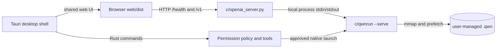

# Qwanto architecture

Qwanto is a local-first inference product with one native engine, one local
HTTP gateway, one shared web UI, and an optional Tauri host.

## Runtime relationships

1. `c/qwnrun.c` opens a `.qwn` container and performs native inference. Its
   persistent mode keeps one process alive and exchanges framed requests over
   stdin/stdout.
2. `c/openai_server.py` binds to loopback by default, validates requests,
   queues work, serves `web/dist` when present, and owns the native process
   lifecycle. `/health` is the readiness probe; `/v1/*` is the OpenAI-compatible
   API.
3. `web/` is transport-only UI code. It calls the configured gateway and keeps
   the API key in memory. Browser mode has no Tauri IPC, terminal, or arbitrary
   filesystem capability.
4. `desktop/src-tauri/` packages the same web output and adds native runtime
   controls plus an approval-gated coding-agent surface. The release bundle
   includes `qwnrun` but never a model.

## Memory and model boundary

The native decoder preserves the project’s tiered-memory design: VRAM, system
RAM, and NVMe-backed mappings with layer-ahead prefetching. Models are selected
by path and validated as `.qwn` containers before launch. GGUF is an external
runtime path and is unavailable in the native desktop path by default.

## Support status

| Surface | Status | Evidence |
| --- | --- | --- |
| Native C build and decoder tests | Supported on CI Linux/Windows | `.github/workflows/ci.yml` |
| Local gateway and OpenAI-compatible API | Beta | `c/tests/` |
| Browser dashboard | Beta | `web` build and Vitest |
| Tauri Windows/Linux packaging | Release workflow | `.github/workflows/release.yml` |
| macOS packaging | Experimental until a macOS run is observed | tag workflow only |
| Large real-model inference | Fixture-dependent | tests skip only when the named model is absent |
